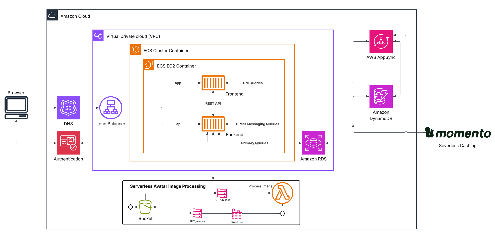

# Billing and Architecture

## Conceptual Diagram 

This diagram provides a high-level architectural overview of the application. It is designed to ensure all stakeholders, including those in non-technical roles, can understand the system's core structure, focusing on the 'what' and 'why' rather than the 'how' (technical implementation details).


###### Made with Lucidchart.

## Logical Diagram 

This diagram shows how data flows through the system and how different services interact to power the application.

 
###### Made with Lucidchart.

### Core Workflow

- **User Access**: Users connect via Route 53 (DNS) to an Application Load Balancer, which distributes traffic to the containers.

- **Authentication**: AWS Cognito manages user identity and secure login sessions.

- **Application Layer**: The ECS Cluster runs our Frontend and Backend (REST API) inside a secure private network (VPC).

- **Data Storage**: 
    - **RDS** handles the main relational data.

    - **DynamoDB** and **AppSync** manage real-time direct messaging.

    - **Momento** provides a fast, serverless cache to speed up queries.

- **Image Processing**: When an avatar is uploaded to **S3**, an **AWS Lambda function** automatically processes the image and notifies the backend via a **Webhook**.

## AWS CLI

Installing the AWS CLI on my local machine:
```
curl "https://awscli.amazonaws.com/awscli-exe-linux-x86_64.zip" -o "awscliv2.zip"
unzip awscliv2.zip
sudo ./aws/install --bin-dir /usr/local/bin --install-dir /usr/local/aws-cli --update
```

After creating Access Keys for the AWS CLI:
```
aws configure
```

Testing it:
```
aws sts get-caller-identity
```

## Budgets

As I intend to keep expenditure to a minimum and leverage the AWS Free Tier as much as possible, I have configured a monthly cost budget. This includes two specific alerts: one triggered at $0.01 (to catch any non-free tier usage immediately) and another at $0.50.

Setting the AWS Account ID environment variable for convenience:
```
export AWS_ACCOUNT_ID="<Account ID>"
```

#### Budget Definition: 
```aws/json/budget.json```
```
{
    "BudgetLimit": {
        "Amount": "1.0",
        "Unit": "USD"
    },
    "BudgetName": "MyBudget",
    "BudgetType": "COST",
    "CostTypes": {
        "IncludeCredit": true,
        "IncludeDiscount": true,
        "IncludeOtherSubscription": true,
        "IncludeRecurring": true,
        "IncludeRefund": true,
        "IncludeSubscription": true,
        "IncludeSupport": true,
        "IncludeTax": true,
        "IncludeUpfront": true,
        "UseBlended": false
    },
    "TimeUnit": "MONTHLY"
}
```

#### Budget Alerts:
```aws/json/budget-notifications-with-subscribers.json```
```
[
    {
        "Notification": {
            "ComparisonOperator": "GREATER_THAN",
            "NotificationType": "ACTUAL",
            "Threshold": 1,
            "ThresholdType": "PERCENTAGE"
        },
        "Subscribers": [
            {
                "Address": "email@cruddur.com",
                "SubscriptionType": "EMAIL"
            }
        ]
    },
    {
        "Notification": {
            "ComparisonOperator": "GREATER_THAN",
            "NotificationType": "ACTUAL",
            "Threshold": 50,
            "ThresholdType": "PERCENTAGE"
        },
        "Subscribers": [
                      {
                "Address": "email@cruddur.com",
                "SubscriptionType": "EMAIL"
            }
        ]
    }
]
```

####  Creating the Budget:
```
aws budgets create-budget \
    --account-id $AWS_ACCOUNT_ID \
    --budget file://aws/json/budget.json \
    --notifications-with-subscribers file://aws/json/budget-notifications-with-subscribers.json
```

